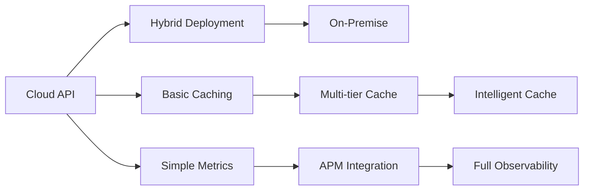

# Kiến Trúc Tham Khảo cho Các Scenario Thực Tế

## Giải Thích Chi Tiết Từng Layer

### Layer 1: Data Ingestion Layer
**Chức năng**: Thu thập và tiếp nhận dữ liệu từ các nguồn khác nhau (Git webhooks, APIs, file uploads)

**Ưu điểm**:
- Decoupling giữa data sources và processing
- Dễ dàng thêm nguồn dữ liệu mới
- Support multiple protocols (HTTP, gRPC, WebSocket)

**Nhược điểm**:
- Cần handle nhiều format khác nhau
- Potential bottleneck nếu không scale properly
- Complexity trong error handling

**Alternatives**:
- Apache Kafka cho high-throughput scenarios
- AWS Kinesis cho cloud-native approach
- RabbitMQ cho enterprise messaging
- Redis Streams cho real-time processing

### Layer 2: API Gateway / Load Balancer
**Chức năng**: Route requests, load balancing, authentication, rate limiting

**Ưu điểm**:
- Single entry point cho tất cả services
- Built-in security features
- Easy monitoring và logging
- Horizontal scaling

**Nhược điểm**:
- Single point of failure nếu không HA
- Added latency
- Configuration complexity

**Alternatives**:
- Kong Gateway (open source, plugin ecosystem)
- AWS API Gateway (managed service)
- Nginx Plus (enterprise features)
- Traefik (cloud-native, automatic discovery)
- Istio (service mesh cho microservices)

### Layer 3: Service Layer
**Chức năng**: Business logic implementation, task-specific processing

**Ưu điểm**:
- Separation of concerns
- Independent scaling của từng service
- Technology agnostic (có thể mix languages)
- Easy testing và maintenance

**Nhược điểm**:
- Inter-service communication overhead
- Distributed system complexity
- Need service discovery mechanism

**Alternatives**:
- Monolithic approach cho small teams
- Serverless functions (AWS Lambda, Azure Functions)
- Actor model (Akka, Orleans)
- Event-driven architecture với Event Sourcing

### Layer 4: Model Serving Layer
**Chức năng**: Host và serve ML models, handle inference requests

**Ưu điểm**:
- Optimized cho ML workloads
- Support multiple model versions
- Hardware acceleration (GPU/TPU)
- Model A/B testing capabilities

**Nhược điểm**:
- Resource intensive
- Cold start issues
- Model versioning complexity
- Expensive infrastructure

**Alternatives**:
- TensorFlow Serving (Google's solution)
- TorchServe (PyTorch native)
- ONNX Runtime (cross-framework)
- Triton Inference Server (NVIDIA, multi-framework)
- SageMaker (AWS managed)
- Vertex AI (Google Cloud)
- Azure ML (Microsoft)

### Layer 5: Storage Layer
**Chức năng**: Persist data, models, và results

**Ưu điểm**:
- Data durability
- Historical analysis capability
- Audit trail
- Backup và recovery

**Nhược điểm**:
- Storage costs
- Data consistency challenges
- Privacy và compliance concerns

**Alternatives**:
- PostgreSQL cho structured data
- MongoDB cho document storage
- S3/MinIO cho object storage
- Redis cho caching
- Elasticsearch cho search
- TimescaleDB cho time-series data

---

## 1. Kiến Trúc Hệ Thống Code Review Tự Động cho Enterprise

### Scenario
Công ty phần mềm lớn với 500+ developers, muốn tự động hóa code review process để giảm workload và tăng code quality.

### Architecture Design

```
┌─────────────────────────────────────────────────────────────┐
│                     Git Repository (GitLab/GitHub)           │
└────────────────────┬────────────────────────────────────────┘
                     │ Webhook (PR/MR events)
                     ▼
┌─────────────────────────────────────────────────────────────┐
│                    API Gateway / Load Balancer               │
└────────────────────┬────────────────────────────────────────┘
                     │
        ┌────────────┴────────────┬─────────────────┐
        ▼                         ▼                 ▼
┌───────────────┐       ┌───────────────┐   ┌───────────────┐
│Review Necessity│       │Comment        │   │Code Refinement│
│Prediction     │       │Generation     │   │Service        │
│Service        │       │Service        │   │               │
└───────┬───────┘       └───────┬───────┘   └───────┬───────┘
        │                       │                     │
        └───────────────┬───────┴─────────────────────┘
                        ▼
┌─────────────────────────────────────────────────────────────┐
│                    Model Serving Layer                       │
│  ┌─────────────┐  ┌──────────────┐  ┌─────────────────┐   │
│  │Base LLaMA   │  │LoRA Adapter  │  │LoRA Adapter     │   │
│  │Model (7B)   │  │RNP Task      │  │RCG Task         │   │
│  └─────────────┘  └──────────────┘  └─────────────────┘   │
└─────────────────────────────────────────────────────────────┘
```

### Giải Thích Chi Tiết Các Components

#### 1. Git Repository Layer
**Chức năng**: 
- Source code management
- Webhook triggers cho PR/MR events
- Integration với CI/CD pipeline

**Ưu điểm**:
- Native integration với development workflow
- Automatic triggers không cần manual intervention
- Full audit trail của changes

**Nhược điểm**:
- Dependency on Git provider availability
- Rate limiting từ provider
- Webhook security concerns

**Alternatives**:
- Bitbucket cho Atlassian ecosystem
- Azure DevOps cho Microsoft stack
- Self-hosted GitLab cho full control
- Gitea cho lightweight deployment

#### 2. API Gateway / Load Balancer
**Chức năng**:
- Request routing và load distribution
- Authentication & authorization
- Rate limiting và throttling
- SSL termination

**Ưu điểm**:
- Centralized security policies
- Horizontal scaling capability
- Request/response transformation
- Built-in monitoring

**Nhược điểm**:
- Additional hop increases latency
- Configuration complexity
- Potential single point of failure

**Alternatives**:
- HAProxy cho high performance
- Envoy cho cloud-native
- AWS ALB cho managed solution
- Cloudflare cho global distribution

#### 3. Service Layer (3 Services)
**Review Necessity Prediction Service**:
- **Chức năng**: Phân loại diff hunks cần review
- **Ưu điểm**: Giảm noise, focus on important changes
- **Nhược điểm**: Potential false negatives

**Comment Generation Service**:
- **Chức năng**: Generate meaningful review comments
- **Ưu điểm**: Consistent quality, 24/7 availability
- **Nhược điểm**: May lack context understanding

**Code Refinement Service**:
- **Chức năng**: Suggest code improvements
- **Ưu điểm**: Automated refactoring suggestions
- **Nhược điểm**: May not understand business logic

#### 4. Model Serving Layer
**Chức năng**:
- Host base model và LoRA adapters
- Handle inference requests
- Model versioning và A/B testing

**Ưu điểm**:
- Shared base model saves memory
- Fast adapter switching
- GPU optimization
- Batch inference support

**Nhược điểm**:
- GPU costs
- Model loading time
- Memory constraints
- Scaling challenges

**Implementation Considerations**:
```python
# Model loading strategy
class ModelManager:
    def __init__(self):
        # Load base model once
        self.base_model = load_base_model()
        
        # Cache LoRA adapters
        self.adapters = {
            'rnp': load_lora_adapter('review_necessity'),
            'rcg': load_lora_adapter('comment_generation'),
            'cr': load_lora_adapter('code_refinement')
        }
    
    def switch_adapter(self, task_type):
        # Fast adapter switching without reloading base
        self.base_model.set_adapter(self.adapters[task_type])
```

### Implementation Details

#### 1. Model Deployment
```python
# model_server.py
import torch
from transformers import LlamaForCausalLM, LlamaTokenizer
from peft import PeftModel, LoraConfig

class CodeReviewModelServer:
    def __init__(self, base_model_path, lora_weights_path):
        # Load base model
        self.model = LlamaForCausalLM.from_pretrained(
            base_model_path,
            torch_dtype=torch.float16,
            device_map="auto"
        )
        
        # Load LoRA adapter
        self.model = PeftModel.from_pretrained(
            self.model,
            lora_weights_path
        )
        
        self.tokenizer = LlamaTokenizer.from_pretrained(base_model_path)
    
    def predict_review_necessity(self, diff_hunk):
        prompt = f"""### Instruction:
Determine whether the provided diff hunk requires a code review. Respond with either 'yes' or 'no'.

### Input:
The diff hunk is: '{diff_hunk}'

### Response:"""
        
        inputs = self.tokenizer(prompt, return_tensors="pt")
        outputs = self.model.generate(**inputs, max_new_tokens=10)
        response = self.tokenizer.decode(outputs[0], skip_special_tokens=True)
        
        return "yes" in response.lower()
```

#### 2. Service Architecture
```python
# review_service.py
from fastapi import FastAPI, BackgroundTasks
from typing import List, Dict
import asyncio

app = FastAPI()

class ReviewOrchestrator:
    def __init__(self):
        self.rnp_model = CodeReviewModelServer(
            "llama-7b-base",
            "lora-weights/rnp-task"
        )
        self.rcg_model = CodeReviewModelServer(
            "llama-7b-base", 
            "lora-weights/rcg-task"
        )
        
    async def process_pull_request(self, pr_data: Dict):
        results = []
        
        # Extract diff hunks
        diff_hunks = self.extract_diff_hunks(pr_data)
        
        # Parallel processing for efficiency
        tasks = []
        for hunk in diff_hunks:
            if self.rnp_model.predict_review_necessity(hunk):
                tasks.append(self.generate_review_comment(hunk))
        
        comments = await asyncio.gather(*tasks)
        return comments
    
    async def generate_review_comment(self, hunk):
        # Generate comment using RCG model
        return self.rcg_model.generate_comment(hunk)

@app.post("/webhook/pull-request")
async def handle_pr_webhook(pr_data: Dict, background_tasks: BackgroundTasks):
    orchestrator = ReviewOrchestrator()
    background_tasks.add_task(orchestrator.process_pull_request, pr_data)
    return {"status": "processing"}
```

#### 3. Caching và Optimization
```python
# cache_layer.py
import redis
import hashlib
from functools import lru_cache

class ModelCache:
    def __init__(self):
        self.redis_client = redis.Redis(
            host='localhost',
            port=6379,
            decode_responses=True
        )
        
    def get_cached_prediction(self, input_text, task_type):
        cache_key = self._generate_key(input_text, task_type)
        return self.redis_client.get(cache_key)
    
    def cache_prediction(self, input_text, task_type, result, ttl=3600):
        cache_key = self._generate_key(input_text, task_type)
        self.redis_client.setex(cache_key, ttl, result)
    
    def _generate_key(self, input_text, task_type):
        content_hash = hashlib.md5(input_text.encode()).hexdigest()
        return f"{task_type}:{content_hash}"
```

### Deployment Configuration

#### Docker Compose
```yaml
version: '3.8'

services:
  model-server:
    build: ./model-server
    ports:
      - "8000:8000"
    volumes:
      - ./models:/models
      - ./lora-weights:/lora-weights
    deploy:
      resources:
        reservations:
          devices:
            - driver: nvidia
              count: 1
              capabilities: [gpu]
    
  redis:
    image: redis:7-alpine
    ports:
      - "6379:6379"
    
  nginx:
    image: nginx:alpine
    ports:
      - "80:80"
    volumes:
      - ./nginx.conf:/etc/nginx/nginx.conf
    depends_on:
      - model-server
```

---

## 2. Kiến Trúc Training Pipeline cho Code Generation Dataset

### Scenario
Research lab muốn xây dựng pipeline để continuous training và evaluation của code generation models.

### Architecture Design

```
┌─────────────────────────────────────────────────────────────┐
│                    Data Collection Layer                     │
│  ┌──────────┐  ┌──────────┐  ┌──────────┐  ┌──────────┐   │
│  │LeetCode  │  │GitHub    │  │CodeForces│  │Internal  │   │
│  │Scraper   │  │Crawler   │  │API       │  │Dataset   │   │
│  └────┬─────┘  └────┬─────┘  └────┬─────┘  └────┬─────┘   │
└───────┴─────────────┴──────────────┴──────────────┴─────────┘
                                │
                                ▼
┌─────────────────────────────────────────────────────────────┐
│                    Data Processing Pipeline                  │
│  ┌────────────┐  ┌────────────┐  ┌────────────┐           │
│  │Dedup &     │  │Test Case   │  │Quality     │           │
│  │Filter      │  │Generation  │  │Validation  │           │
│  └────────────┘  └────────────┘  └────────────┘           │
└─────────────────────────────────────────────────────────────┘
                                │
                                ▼
┌─────────────────────────────────────────────────────────────┐
│                    Training Infrastructure                   │
│  ┌────────────┐  ┌────────────┐  ┌────────────┐           │
│  │Dataset     │  │Training    │  │Evaluation  │           │
│  │Versioning  │  │Scheduler   │  │Service     │           │
│  └────────────┘  └────────────┘  └────────────┘           │
└─────────────────────────────────────────────────────────────┘
```

### Giải Thích Chi Tiết Các Components

#### 1. Data Collection Layer
**Chức năng**:
- Thu thập problems từ multiple sources
- Handle different formats và APIs
- Respect rate limits và robots.txt

**Components**:
- **LeetCode Scraper**: GraphQL API integration
- **GitHub Crawler**: Repository mining cho real code
- **CodeForces API**: Competition problems
- **Internal Dataset**: Proprietary problems

**Ưu điểm**:
- Diverse data sources
- Real-world problems
- Continuous updates
- Quality benchmarks

**Nhược điểm**:
- API rate limits
- Data licensing issues
- Format inconsistencies
- Maintenance overhead

**Alternatives**:
- HackerRank API
- AtCoder scraping
- Project Euler problems
- Kaggle competitions
- Stack Overflow snippets

#### 2. Data Processing Pipeline
**Dedup & Filter Component**:
- **Chức năng**: Remove duplicates, filter low quality
- **Ưu điểm**: Clean dataset, reduced training noise
- **Nhược điểm**: May lose some valid variations

**Test Case Generation**:
- **Chức năng**: Generate comprehensive test suites
- **Ưu điểm**: Better evaluation, catch edge cases
- **Nhược điểm**: Computational cost, may miss corner cases

**Quality Validation**:
- **Chức năng**: Verify solution correctness
- **Ưu điểm**: High-quality training data
- **Nhược điểm**: Slow process, requires execution environment

**Implementation Strategy**:
```python
class DataProcessingPipeline:
    def __init__(self):
        self.deduplicator = MinHashDeduplicator()
        self.test_generator = LLMTestGenerator()
        self.validator = SandboxValidator()
    
    async def process_batch(self, problems):
        # Parallel processing for efficiency
        unique_problems = await self.deduplicator.filter(problems)
        
        tasks = []
        for problem in unique_problems:
            tasks.append(self.process_single(problem))
        
        return await asyncio.gather(*tasks)
```

#### 3. Training Infrastructure Layer
**Dataset Versioning**:
- **Chức năng**: Track dataset changes, reproducibility
- **Tools**: DVC, MLflow, Weights & Biases
- **Ưu điểm**: Experiment tracking, rollback capability
- **Nhược điểm**: Storage overhead, complexity

**Training Scheduler**:
- **Chức năng**: Orchestrate training jobs
- **Tools**: Airflow, Kubeflow, Argo
- **Ưu điểm**: Automated workflows, resource optimization
- **Nhược điểm**: Setup complexity, learning curve

**Evaluation Service**:
- **Chức năng**: Continuous model evaluation
- **Metrics**: Pass@k, BLEU, execution accuracy
- **Ưu điểm**: Real-time performance tracking
- **Nhược điểm**: Computational resources

**Resource Considerations**:
```yaml
# Kubernetes deployment for training
apiVersion: batch/v1
kind: Job
metadata:
  name: model-training
spec:
  template:
    spec:
      containers:
      - name: trainer
        image: code-gen-trainer:latest
        resources:
          requests:
            memory: "32Gi"
            nvidia.com/gpu: 4
          limits:
            memory: "64Gi"
            nvidia.com/gpu: 4
```

### Implementation Details

#### 1. Data Collection & Processing
```python
# data_pipeline.py
import asyncio
from datetime import datetime
from typing import List, Dict
import aiohttp

class LeetCodeCollector:
    def __init__(self):
        self.api_endpoint = "https://leetcode.com/graphql"
        self.session = None
        
    async def collect_problems(self, after_date: datetime):
        """Collect problems released after specific date"""
        query = """
        query questionData($titleSlug: String!) {
            question(titleSlug: $titleSlug) {
                questionId
                title
                difficulty
                topicTags { name }
                codeSnippets { lang code }
                sampleTestCase
            }
        }
        """
        
        problems = []
        async with aiohttp.ClientSession() as session:
            # Fetch problem list
            problem_slugs = await self.get_problem_list(after_date)
            
            # Batch fetch problem details
            for batch in self.batch_items(problem_slugs, 10):
                tasks = [
                    self.fetch_problem_detail(session, slug, query)
                    for slug in batch
                ]
                batch_results = await asyncio.gather(*tasks)
                problems.extend(batch_results)
        
        return problems
    
    def batch_items(self, items, batch_size):
        for i in range(0, len(items), batch_size):
            yield items[i:i + batch_size]
```

#### 2. Test Case Generation
```python
# test_generation.py
from typing import List, Dict
import ast
import random

class TestCaseGenerator:
    def __init__(self, llm_model):
        self.llm = llm_model
        
    async def generate_test_cases(self, problem: Dict) -> List[Dict]:
        """Generate diverse test cases for a problem"""
        
        # Generate basic test cases
        basic_prompt = f"""
        Generate 10 simple test cases for this problem:
        {problem['description']}
        
        Function signature: {problem['starter_code']}
        """
        basic_cases = await self.llm.generate(basic_prompt)
        
        # Generate edge cases
        edge_prompt = f"""
        Generate 10 edge test cases including:
        - Maximum constraints
        - Minimum constraints
        - Special cases (empty, null, etc.)
        
        Problem: {problem['description']}
        """
        edge_cases = await self.llm.generate(edge_prompt)
        
        # Validate and combine
        all_cases = self.parse_cases(basic_cases) + self.parse_cases(edge_cases)
        return self.validate_cases(all_cases, problem)
    
    def validate_cases(self, cases: List, problem: Dict) -> List[Dict]:
        """Validate test cases against canonical solution"""
        validated = []
        
        for case in cases:
            try:
                # Execute canonical solution
                result = self.execute_solution(
                    problem['canonical_solution'],
                    case['input']
                )
                case['expected_output'] = result
                validated.append(case)
            except Exception as e:
                print(f"Invalid test case: {e}")
                
        return validated
```

#### 3. Training Pipeline
```python
# training_pipeline.py
from transformers import TrainingArguments, Trainer
from peft import LoraConfig, get_peft_model
import wandb

class CodeGenTrainingPipeline:
    def __init__(self, config):
        self.config = config
        wandb.init(project="code-generation")
        
    def prepare_dataset(self, raw_data):
        """Prepare dataset with temporal split"""
        cutoff_date = datetime(2024, 7, 1)
        
        train_data = [
            d for d in raw_data 
            if d['release_date'] < cutoff_date
        ]
        test_data = [
            d for d in raw_data 
            if d['release_date'] >= cutoff_date
        ]
        
        # Format for training
        train_dataset = self.format_for_sft(train_data)
        test_dataset = self.format_for_sft(test_data)
        
        return train_dataset, test_dataset
    
    def setup_peft_model(self, base_model):
        """Configure LoRA for efficient training"""
        peft_config = LoraConfig(
            r=16,
            lora_alpha=32,
            target_modules=["q_proj", "v_proj", "k_proj", "o_proj"],
            lora_dropout=0.1,
            bias="none",
            task_type="CAUSAL_LM"
        )
        
        return get_peft_model(base_model, peft_config)
    
    def train(self, model, train_dataset, eval_dataset):
        """Main training loop"""
        training_args = TrainingArguments(
            output_dir="./results",
            num_train_epochs=3,
            per_device_train_batch_size=4,
            per_device_eval_batch_size=4,
            gradient_accumulation_steps=4,
            warmup_ratio=0.1,
            logging_steps=10,
            save_steps=500,
            evaluation_strategy="steps",
            eval_steps=100,
            save_total_limit=3,
            load_best_model_at_end=True,
            report_to="wandb"
        )
        
        trainer = Trainer(
            model=model,
            args=training_args,
            train_dataset=train_dataset,
            eval_dataset=eval_dataset,
            compute_metrics=self.compute_metrics
        )
        
        trainer.train()
```

---

## 3. Kiến Trúc Production Code Assistant

### Scenario
Startup muốn xây dựng VS Code extension với AI-powered code assistance.

### Architecture Design

```
┌─────────────────────────────────────────────────────────────┐
│                    VS Code Extension                         │
│  ┌──────────┐  ┌──────────┐  ┌──────────┐  ┌──────────┐   │
│  │Code      │  │Review    │  │Problem   │  │Test      │   │
│  │Completion│  │Assistant │  │Solver    │  │Generator │   │
│  └────┬─────┘  └────┬─────┘  └────┬─────┘  └────┬─────┘   │
└───────┴─────────────┴──────────────┴──────────────┴─────────┘
                                │
                                ▼
┌─────────────────────────────────────────────────────────────┐
│                    Local Model Runtime                       │
│  ┌────────────┐  ┌────────────┐  ┌────────────┐           │
│  │ONNX Runtime│  │Model Cache │  │Request Queue│           │
│  └────────────┘  └────────────┘  └────────────┘           │
└─────────────────────────────────────────────────────────────┘
                                │
                                ▼
┌─────────────────────────────────────────────────────────────┐
│                    Cloud API (Fallback)                      │
└─────────────────────────────────────────────────────────────┘
```

### Giải Thích Chi Tiết Các Components

#### 1. VS Code Extension Layer
**Chức năng**:
- User interface integration
- Context extraction from editor
- Feature toggles và preferences
- Telemetry collection

**Components**:
- **Code Completion**: Real-time suggestions
- **Review Assistant**: On-demand code review
- **Problem Solver**: Algorithm suggestions
- **Test Generator**: Unit test creation

**Ưu điểm**:
- Native IDE integration
- Rich context awareness
- Offline capability
- Low latency

**Nhược điểm**:
- Platform specific (VS Code only)
- Extension size limits
- Update distribution delays
- Limited compute resources

**Alternatives**:
- JetBrains plugin system
- Vim/Neovim plugins
- Sublime Text packages
- Language Server Protocol (LSP)
- Browser extensions

#### 2. Local Model Runtime
**ONNX Runtime Component**:
- **Chức năng**: Execute quantized models locally
- **Ưu điểm**: Fast inference, privacy, offline work
- **Nhược điểm**: Limited model size, CPU only

**Model Cache**:
- **Chức năng**: Store frequently used model outputs
- **Ưu điểm**: Instant responses, reduced compute
- **Nhược điểm**: Storage usage, cache invalidation

**Request Queue**:
- **Chức năng**: Prioritize và batch requests
- **Ưu điểm**: Better UX, resource efficiency
- **Nhược điểm**: Queue management complexity

**Performance Optimization**:
```typescript
class LocalRuntime {
    constructor() {
        this.session = new onnx.InferenceSession({
            // Use WebAssembly for browser compatibility
            executionProviders: ['wasm'],
            graphOptimizationLevel: 'all',
            enableCpuMemArena: true,
            enableMemPattern: true
        });
        
        // Priority queue for request management
        this.queue = new PriorityQueue({
            comparator: (a, b) => a.priority - b.priority
        });
    }
    
    async processRequest(request: CodeRequest): Promise<CodeSuggestion> {
        // Check cache first
        const cached = await this.cache.get(request.hash);
        if (cached) return cached;
        
        // Add to queue with smart prioritization
        const priority = this.calculatePriority(request);
        return this.queue.enqueue(request, priority);
    }
}
```

#### 3. Cloud API Fallback Layer
**Chức năng**:
- Handle complex requests beyond local capacity
- Provide latest model updates
- Batch processing for efficiency
- Analytics và usage tracking

**Ưu điểm**:
- Access to larger models
- Latest improvements
- No local resource constraints
- Central monitoring

**Nhược điểm**:
- Network dependency
- Latency issues
- Privacy concerns
- API costs

**Hybrid Strategy**:
```typescript
class HybridModelClient {
    async getSuggestion(code: string, context: Context): Promise<Suggestion> {
        // Decision logic for local vs cloud
        const complexity = this.estimateComplexity(code);
        
        if (complexity < COMPLEXITY_THRESHOLD && this.localModel.isReady()) {
            try {
                return await this.localModel.predict(code, context);
            } catch (e) {
                // Fallback to cloud on local failure
                console.warn('Local prediction failed, falling back to cloud', e);
            }
        }
        
        // Use cloud for complex requests or when local fails
        return await this.cloudAPI.predict(code, context);
    }
    
    estimateComplexity(code: string): number {
        // Heuristics: length, nesting depth, special constructs
        const factors = {
            length: code.length / 1000,
            depth: this.calculateNestingDepth(code),
            constructs: this.countComplexConstructs(code)
        };
        
        return factors.length * 0.3 + 
               factors.depth * 0.4 + 
               factors.constructs * 0.3;
    }
}
```

### Implementation Details

#### 1. VS Code Extension
```typescript
// extension.ts
import * as vscode from 'vscode';
import { ModelClient } from './modelClient';

export function activate(context: vscode.ExtensionContext) {
    const modelClient = new ModelClient();
    
    // Code completion provider
    const completionProvider = vscode.languages.registerCompletionItemProvider(
        ['python', 'javascript', 'typescript', 'java'],
        {
            async provideCompletionItems(document, position) {
                const linePrefix = document.lineAt(position).text.substr(0, position.character);
                
                if (shouldTriggerCompletion(linePrefix)) {
                    const context = extractContext(document, position);
                    const suggestions = await modelClient.getCompletions(context);
                    
                    return suggestions.map(s => {
                        const item = new vscode.CompletionItem(s.text);
                        item.insertText = new vscode.SnippetString(s.snippet);
                        item.documentation = s.explanation;
                        return item;
                    });
                }
            }
        }
    );
    
    // Code review command
    const reviewCommand = vscode.commands.registerCommand(
        'codeassistant.reviewCode',
        async () => {
            const editor = vscode.window.activeTextEditor;
            if (!editor) return;
            
            const selection = editor.selection;
            const text = editor.document.getText(selection);
            
            const reviews = await modelClient.reviewCode(text);
            showReviewPanel(reviews);
        }
    );
    
    context.subscriptions.push(completionProvider, reviewCommand);
}
```

#### 2. Local Model Runtime
```python
# local_runtime.py
import onnxruntime as ort
from transformers import AutoTokenizer
import numpy as np
from queue import PriorityQueue
import threading

class LocalModelRuntime:
    def __init__(self, model_path: str):
        # Load quantized model for efficiency
        self.session = ort.InferenceSession(
            f"{model_path}/model_int8.onnx",
            providers=['CPUExecutionProvider']
        )
        self.tokenizer = AutoTokenizer.from_pretrained(model_path)
        
        # Request queue for managing multiple requests
        self.request_queue = PriorityQueue()
        self.worker_thread = threading.Thread(target=self._process_requests)
        self.worker_thread.start()
    
    def predict(self, prompt: str, priority: int = 5):
        """Add prediction request to queue"""
        future = Future()
        self.request_queue.put((priority, prompt, future))
        return future
    
    def _process_requests(self):
        """Process requests from queue"""
        while True:
            priority, prompt, future = self.request_queue.get()
            
            try:
                # Tokenize input
                inputs = self.tokenizer(
                    prompt,
                    return_tensors="np",
                    max_length=512,
                    truncation=True
                )
                
                # Run inference
                outputs = self.session.run(
                    None,
                    {
                        'input_ids': inputs['input_ids'],
                        'attention_mask': inputs['attention_mask']
                    }
                )
                
                # Decode output
                result = self.tokenizer.decode(
                    outputs[0][0],
                    skip_special_tokens=True
                )
                
                future.set_result(result)
                
            except Exception as e:
                future.set_exception(e)
```

#### 3. Smart Caching Layer
```python
# smart_cache.py
import sqlite3
import json
from datetime import datetime, timedelta
import hashlib

class SmartCache:
    def __init__(self, db_path: str = "cache.db"):
        self.conn = sqlite3.connect(db_path)
        self._init_db()
        
    def _init_db(self):
        self.conn.execute("""
            CREATE TABLE IF NOT EXISTS cache (
                key TEXT PRIMARY KEY,
                value TEXT,
                context TEXT,
                hits INTEGER DEFAULT 1,
                created_at TIMESTAMP,
                last_accessed TIMESTAMP
            )
        """)
        
    def get(self, prompt: str, context: str = "") -> Optional[str]:
        """Get cached result with context awareness"""
        key = self._generate_key(prompt, context)
        
        cursor = self.conn.execute("""
            SELECT value, hits FROM cache 
            WHERE key = ? AND created_at > ?
        """, (key, datetime.now() - timedelta(hours=24)))
        
        result = cursor.fetchone()
        if result:
            # Update hit count and last accessed
            self.conn.execute("""
                UPDATE cache 
                SET hits = hits + 1, last_accessed = ?
                WHERE key = ?
            """, (datetime.now(), key))
            self.conn.commit()
            
            return result[0]
        
        return None
    
    def set(self, prompt: str, value: str, context: str = ""):
        """Cache result with context"""
        key = self._generate_key(prompt, context)
        
        self.conn.execute("""
            INSERT OR REPLACE INTO cache 
            (key, value, context, created_at, last_accessed)
            VALUES (?, ?, ?, ?, ?)
        """, (key, value, context, datetime.now(), datetime.now()))
        
        self.conn.commit()
        
    def _generate_key(self, prompt: str, context: str) -> str:
        """Generate cache key from prompt and context"""
        content = f"{prompt}|{context}"
        return hashlib.sha256(content.encode()).hexdigest()
```

---

## 4. Kiến Trúc Continuous Learning System

### Scenario
Enterprise cần system tự động học từ code reviews và cải thiện theo thời gian.

### Architecture Design

```
┌─────────────────────────────────────────────────────────────┐
│                    Feedback Collection                       │
│  ┌──────────┐  ┌──────────┐  ┌──────────┐  ┌──────────┐   │
│  │User      │  │Automated │  │Code      │  │Performance│  │
│  │Feedback  │  │Metrics   │  │Quality   │  │Monitoring │  │
│  └────┬─────┘  └────┬─────┘  └────┬─────┘  └────┬─────┘   │
└───────┴─────────────┴──────────────┴──────────────┴─────────┘
                                │
                                ▼
┌─────────────────────────────────────────────────────────────┐
│                    Data Processing & Labeling                │
│  ┌────────────┐  ┌────────────┐  ┌────────────┐           │
│  │Data        │  │Quality     │  │Priority    │           │
│  │Validation  │  │Scoring     │  │Assignment  │           │
│  └────────────┘  └────────────┘  └────────────┘           │
└─────────────────────────────────────────────────────────────┘
                                │
                                ▼
┌─────────────────────────────────────────────────────────────┐
│                    Continuous Training Loop                  │
│  ┌────────────┐  ┌────────────┐  ┌────────────┐           │
│  │Active      │  │Online      │  │A/B Testing │           │
│  │Learning    │  │Learning    │  │Framework   │           │
│  └────────────┘  └────────────┘  └────────────┘           │
└─────────────────────────────────────────────────────────────┘
```

### Giải Thích Chi Tiết Các Components

#### 1. Feedback Collection Layer
**Chức năng**:
- Thu thập multi-source feedback
- Real-time event streaming
- Correlation với outcomes
- Privacy-preserving collection

**Components**:
- **User Feedback**: Explicit ratings, comments
- **Automated Metrics**: Execution success, performance
- **Code Quality**: Static analysis, complexity metrics
- **Performance Monitoring**: Latency, resource usage

**Ưu điểm**:
- Comprehensive signal collection
- Real-world validation
- Continuous improvement data
- Objective metrics

**Nhược điểm**:
- Data volume challenges
- Noise in feedback
- Privacy concerns
- Integration complexity

**Implementation Approach**:
```python
class FeedbackCollectionSystem:
    def __init__(self):
        self.collectors = {
            'user': UserFeedbackCollector(),
            'metrics': AutomatedMetricsCollector(),
            'quality': CodeQualityAnalyzer(),
            'performance': PerformanceMonitor()
        }
        
        # Event streaming setup
        self.event_stream = KafkaProducer(
            bootstrap_servers=['localhost:9092'],
            value_serializer=lambda x: json.dumps(x).encode('utf-8')
        )
    
    async def collect_feedback(self, event_type: str, data: dict):
        # Enrich with context
        enriched_data = {
            'timestamp': datetime.utcnow().isoformat(),
            'event_type': event_type,
            'session_id': self.get_session_id(),
            'user_hash': self.hash_user_id(data.get('user_id')),
            **data
        }
        
        # Privacy filtering
        filtered_data = self.privacy_filter(enriched_data)
        
        # Stream to processing pipeline
        self.event_stream.send('feedback-events', filtered_data)
```

#### 2. Data Processing & Labeling Layer
**Data Validation**:
- **Chức năng**: Ensure data quality, completeness
- **Techniques**: Schema validation, outlier detection
- **Ưu điểm**: Clean training data
- **Nhược điểm**: May filter valid edge cases

**Quality Scoring**:
- **Chức năng**: Assign quality scores to feedback
- **Metrics**: User reputation, consistency, outcome correlation
- **Ưu điểm**: Weighted learning
- **Nhược điểm**: Bias introduction risk

**Priority Assignment**:
- **Chức năng**: Prioritize high-value learning opportunities
- **Criteria**: Business impact, frequency, confidence
- **Ưu điểm**: Efficient resource usage
- **Nhược điểm**: May miss rare but important cases

**Processing Pipeline**:
```python
class DataProcessingPipeline:
    def __init__(self):
        self.validator = DataValidator()
        self.scorer = QualityScorer()
        self.prioritizer = PriorityAssigner()
        
    async def process_feedback_batch(self, feedback_batch):
        # Parallel validation
        validation_tasks = [
            self.validator.validate(feedback) 
            for feedback in feedback_batch
        ]
        valid_feedback = await asyncio.gather(*validation_tasks)
        
        # Quality scoring with ML model
        scored_feedback = []
        for feedback in valid_feedback:
            if feedback.is_valid:
                score = self.scorer.calculate_score(feedback)
                priority = self.prioritizer.assign_priority(feedback, score)
                
                scored_feedback.append({
                    **feedback.data,
                    'quality_score': score,
                    'priority': priority,
                    'processing_timestamp': datetime.utcnow()
                })
        
        return scored_feedback
```

#### 3. Continuous Training Loop
**Active Learning**:
- **Chức năng**: Select most informative samples
- **Strategies**: Uncertainty sampling, diversity sampling
- **Ưu điểm**: Efficient labeling budget usage
- **Nhược điểm**: May introduce selection bias

**Online Learning**:
- **Chức năng**: Update model incrementally
- **Techniques**: SGD updates, experience replay
- **Ưu điểm**: Real-time adaptation
- **Nhược điểm**: Catastrophic forgetting risk

**A/B Testing Framework**:
- **Chức năng**: Validate improvements before deployment
- **Metrics**: Success rate, user satisfaction, performance
- **Ưu điểm**: Risk mitigation
- **Nhược điểm**: Slower iteration cycle

**Training Orchestration**:
```python
class ContinuousTrainingOrchestrator:
    def __init__(self):
        self.active_learner = ActiveLearningStrategy()
        self.online_trainer = OnlineTrainer()
        self.ab_tester = ABTestingFramework()
        
    async def training_loop(self):
        while True:
            # Collect recent feedback
            feedback = await self.collect_recent_feedback()
            
            # Active learning selection
            high_value_samples = self.active_learner.select_samples(
                feedback,
                budget=100  # samples per iteration
            )
            
            # Request human labels if needed
            labeled_samples = await self.request_labels(high_value_samples)
            
            # Online training update
            model_update = self.online_trainer.update(
                labeled_samples,
                learning_rate=self.adaptive_lr()
            )
            
            # A/B test new model
            if self.should_test(model_update):
                test_result = await self.ab_tester.run_test(
                    control=self.current_model,
                    treatment=model_update,
                    duration=timedelta(hours=24),
                    traffic_split=0.1  # 10% to treatment
                )
                
                if test_result.is_significant_improvement():
                    await self.deploy_model(model_update)
            
            await asyncio.sleep(3600)  # Run hourly
```

### Implementation Details

#### 1. Feedback Collection System
```python
# feedback_collector.py
from dataclasses import dataclass
from typing import List, Dict, Optional
from enum import Enum

class FeedbackType(Enum):
    ACCEPTED = "accepted"
    REJECTED = "rejected"
    MODIFIED = "modified"
    IGNORED = "ignored"

@dataclass
class ReviewFeedback:
    suggestion_id: str
    feedback_type: FeedbackType
    user_id: str
    timestamp: datetime
    original_code: str
    suggested_code: str
    final_code: Optional[str] = None
    user_comment: Optional[str] = None
    
class FeedbackCollector:
    def __init__(self, storage_backend):
        self.storage = storage_backend
        
    async def collect_feedback(self, feedback: ReviewFeedback):
        """Collect and process user feedback"""
        
        # Validate feedback
        if not self._validate_feedback(feedback):
            return
        
        # Calculate quality score
        quality_score = self._calculate_quality_score(feedback)
        
        # Store feedback with metadata
        await self.storage.store({
            **feedback.__dict__,
            'quality_score': quality_score,
            'processed': False
        })
        
        # Trigger learning pipeline if threshold met
        if await self._should_trigger_learning():
            await self._trigger_learning_pipeline()
    
    def _calculate_quality_score(self, feedback: ReviewFeedback) -> float:
        """Calculate quality score for feedback"""
        score = 0.0
        
        # Base score from feedback type
        if feedback.feedback_type == FeedbackType.ACCEPTED:
            score = 1.0
        elif feedback.feedback_type == FeedbackType.MODIFIED:
            # Calculate similarity between suggested and final
            similarity = self._code_similarity(
                feedback.suggested_code,
                feedback.final_code
            )
            score = 0.5 + (similarity * 0.5)
        elif feedback.feedback_type == FeedbackType.REJECTED:
            score = 0.0
            
        # Adjust based on user reputation
        user_reputation = self._get_user_reputation(feedback.user_id)
        score *= user_reputation
        
        return score
```

#### 2. Active Learning Component
```python
# active_learning.py
import numpy as np
from sklearn.metrics import uncertainty_sampling

class ActiveLearningPipeline:
    def __init__(self, model, uncertainty_threshold=0.8):
        self.model = model
        self.uncertainty_threshold = uncertainty_threshold
        
    async def select_samples_for_labeling(self, unlabeled_data):
        """Select most informative samples for human labeling"""
        
        # Get model predictions with uncertainty
        predictions = []
        for sample in unlabeled_data:
            pred, uncertainty = await self.model.predict_with_uncertainty(
                sample['code'],
                return_uncertainty=True
            )
            predictions.append({
                'sample': sample,
                'prediction': pred,
                'uncertainty': uncertainty
            })
        
        # Sort by uncertainty
        predictions.sort(key=lambda x: x['uncertainty'], reverse=True)
        
        # Select high uncertainty samples
        selected = []
        for pred in predictions:
            if pred['uncertainty'] > self.uncertainty_threshold:
                selected.append(pred['sample'])
            if len(selected) >= 100:  # Batch size limit
                break
                
        return selected
    
    async def update_model_with_labels(self, labeled_samples):
        """Update model with newly labeled samples"""
        
        # Prepare training data
        training_data = self._prepare_training_data(labeled_samples)
        
        # Fine-tune model with LoRA
        updated_weights = await self._fine_tune_lora(
            training_data,
            learning_rate=1e-5,
            epochs=1
        )
        
        # Validate improvement
        if await self._validate_improvement(updated_weights):
            await self._deploy_updated_model(updated_weights)
```

#### 3. A/B Testing Framework
```python
# ab_testing.py
import random
from collections import defaultdict

class ABTestingFramework:
    def __init__(self, models: Dict[str, Any]):
        self.models = models
        self.results = defaultdict(lambda: {
            'requests': 0,
            'successes': 0,
            'failures': 0
        })
        
    async def get_prediction(self, request_data: Dict, user_id: str):
        """Route request to appropriate model variant"""
        
        # Determine model variant for user
        variant = self._get_user_variant(user_id)
        
        # Get prediction from selected model
        model = self.models[variant]
        prediction = await model.predict(request_data)
        
        # Track request
        self.results[variant]['requests'] += 1
        
        return {
            'prediction': prediction,
            'variant': variant,
            'request_id': self._generate_request_id()
        }
    
    def _get_user_variant(self, user_id: str) -> str:
        """Consistently assign users to variants"""
        # Use hash for consistent assignment
        hash_value = hash(user_id) % 100
        
        if hash_value < 10:  # 10% to experimental
            return 'experimental'
        elif hash_value < 20:  # 10% to baseline
            return 'baseline'
        else:  # 80% to production
            return 'production'
    
    async def analyze_results(self):
        """Analyze A/B test results"""
        analysis = {}
        
        for variant, metrics in self.results.items():
            success_rate = (
                metrics['successes'] / metrics['requests']
                if metrics['requests'] > 0 else 0
            )
            
            analysis[variant] = {
                'success_rate': success_rate,
                'sample_size': metrics['requests'],
                'confidence': self._calculate_confidence(metrics)
            }
            
        return analysis
```

---

## Best Practices và Recommendations

### 1. Model Selection Strategy

#### Startup/MVP Stage
**Recommended Approach**: Cloud APIs + Smart Caching
```python
class StartupModelStrategy:
    def __init__(self):
        self.primary = OpenAIAPI()  # or Anthropic, Cohere
        self.cache = RedisCache(ttl=3600)
        self.fallback = HuggingFaceAPI()  # Lower cost alternative
    
    async def get_prediction(self, input_data):
        # Check cache first
        cached = await self.cache.get(input_data.hash)
        if cached:
            return cached
            
        try:
            # Use primary API with timeout
            result = await self.primary.predict(input_data, timeout=5.0)
        except (TimeoutError, RateLimitError):
            # Fallback to cheaper alternative
            result = await self.fallback.predict(input_data)
        
        await self.cache.set(input_data.hash, result)
        return result
```

**Ưu điểm**: Low initial cost, fast time-to-market
**Nhược điểm**: API dependency, privacy concerns

#### Enterprise Stage
**Recommended Approach**: On-premise LoRA Deployment
```python
class EnterpriseModelStrategy:
    def __init__(self):
        self.base_model = load_model("llama-7b")
        self.lora_manager = LoRAManager({
            'code_review': 'lora/review_v2.bin',
            'code_gen': 'lora/codegen_v3.bin',
            'test_gen': 'lora/testgen_v1.bin'
        })
        
    def setup_infrastructure(self):
        return {
            'compute': '4x A100 80GB GPUs',
            'storage': 'NVMe SSD array',
            'network': '100Gbps InfiniBand',
            'redundancy': 'Active-Active HA'
        }
```

**Ưu điểm**: Full control, data privacy, customization
**Nhược điểm**: High upfront cost, maintenance overhead

#### Research Stage
**Recommended Approach**: Multi-checkpoint Experimentation
```python
class ResearchModelStrategy:
    def __init__(self):
        self.checkpoints = CheckpointManager()
        self.experiment_tracker = WandbTracker()
        
    def experiment_setup(self):
        return {
            'models': ['base', 'instruct', 'code-specialized'],
            'sizes': ['7B', '13B', '70B'],
            'techniques': ['full-finetune', 'lora', 'qlora', 'prefix'],
            'datasets': ['internal', 'public', 'synthetic']
        }
```

### 2. Performance Optimization Techniques

#### Request Batching
```python
class BatchProcessor:
    def __init__(self, batch_size=8, timeout_ms=100):
        self.batch_size = batch_size
        self.timeout = timeout_ms / 1000.0
        self.pending_requests = []
        self.lock = asyncio.Lock()
        
    async def add_request(self, request):
        async with self.lock:
            self.pending_requests.append(request)
            
            if len(self.pending_requests) >= self.batch_size:
                return await self._process_batch()
                
        # Wait for timeout or batch to fill
        await asyncio.sleep(self.timeout)
        async with self.lock:
            if self.pending_requests:
                return await self._process_batch()
```

#### Model Quantization Strategy
```python
# Configuration for different scenarios
quantization_configs = {
    'edge_device': {
        'method': 'int4',  # 4-bit quantization
        'group_size': 128,
        'act_order': True,
        'true_sequential': True
    },
    'server_deployment': {
        'method': 'int8',  # 8-bit quantization
        'compute_dtype': torch.float16,
        'use_flash_attention': True
    },
    'high_accuracy': {
        'method': 'nf4',  # 4-bit NormalFloat
        'double_quant': True,
        'compute_dtype': torch.bfloat16
    }
}
```

#### Intelligent Caching
```python
class IntelligentCache:
    def __init__(self):
        self.cache_layers = {
            'l1': InMemoryCache(size_mb=512, ttl=300),
            'l2': RedisCache(ttl=3600),
            'l3': DiskCache(size_gb=100, ttl=86400)
        }
        
    async def get(self, key, context=None):
        # Try each cache layer
        for layer_name, cache in self.cache_layers.items():
            result = await cache.get(key)
            if result:
                # Promote to higher layers
                await self._promote(key, result, layer_name)
                return result
                
        return None
        
    async def set(self, key, value, priority='normal'):
        # Cache based on priority and size
        if priority == 'high' or len(value) < 1000:
            await self.cache_layers['l1'].set(key, value)
        elif priority == 'medium' or len(value) < 10000:
            await self.cache_layers['l2'].set(key, value)
        else:
            await self.cache_layers['l3'].set(key, value)
```

### 3. Monitoring và Observability

#### Comprehensive Metrics Collection
```python
class MetricsCollector:
    def __init__(self):
        self.prometheus = PrometheusClient()
        self.metrics = {
            # Performance metrics
            'latency_histogram': Histogram(
                'model_inference_latency',
                'Model inference latency in seconds',
                buckets=[0.1, 0.5, 1.0, 2.0, 5.0, 10.0]
            ),
            
            # Business metrics
            'acceptance_rate': Gauge(
                'suggestion_acceptance_rate',
                'Rate of accepted AI suggestions'
            ),
            
            # Resource metrics
            'gpu_utilization': Gauge(
                'gpu_utilization_percent',
                'GPU utilization percentage'
            ),
            
            # Quality metrics
            'model_confidence': Histogram(
                'model_confidence_score',
                'Model confidence distribution',
                buckets=[0.1, 0.3, 0.5, 0.7, 0.9, 0.95, 0.99]
            )
        }
        
    @contextmanager
    def track_latency(self, operation):
        start = time.time()
        try:
            yield
        finally:
            duration = time.time() - start
            self.metrics['latency_histogram'].observe(duration)
            
            # Alert if latency exceeds SLA
            if duration > 2.0:  # 2 second SLA
                self.alert_manager.send_alert(
                    'High latency detected',
                    {'operation': operation, 'duration': duration}
                )
```

#### Distributed Tracing
```python
class DistributedTracer:
    def __init__(self):
        self.tracer = OpenTelemetryTracer()
        
    async def trace_request(self, request_id):
        with self.tracer.start_span('code_review_request') as span:
            span.set_attribute('request.id', request_id)
            
            # Trace each component
            with self.tracer.start_span('model_inference'):
                inference_result = await self.model.predict()
                
            with self.tracer.start_span('post_processing'):
                processed = await self.post_process(inference_result)
                
            return processed
```

### 4. Security Best Practices

#### Input Sanitization
```python
class SecurityLayer:
    def __init__(self):
        self.code_scanner = CodeSecurityScanner()
        self.pii_detector = PIIDetector()
        self.rate_limiter = RateLimiter()
        
    async def sanitize_input(self, code_input, user_id):
        # Rate limiting
        if not await self.rate_limiter.check(user_id):
            raise RateLimitExceeded()
            
        # Security scanning
        security_issues = self.code_scanner.scan(code_input)
        if security_issues.critical:
            raise SecurityViolation(security_issues)
            
        # PII detection and removal
        cleaned_code = self.pii_detector.remove_pii(code_input)
        
        # Escape potential injections
        safe_code = self.escape_injections(cleaned_code)
        
        return safe_code
```

#### Secure Model Serving
```yaml
# Kubernetes security configuration
apiVersion: v1
kind: Service
metadata:
  name: model-server
spec:
  type: ClusterIP
  ports:
  - port: 443
    targetPort: 8443
    protocol: TCP
---
apiVersion: v1
kind: ConfigMap
metadata:
  name: model-server-tls
data:
  tls.conf: |
    ssl_protocols TLSv1.3;
    ssl_ciphers ECDHE-RSA-AES256-GCM-SHA384;
    ssl_prefer_server_ciphers on;
    ssl_session_cache shared:SSL:10m;
```

### 5. Cost Optimization Strategies

#### Dynamic Model Routing
```python
class CostOptimizedRouter:
    def __init__(self):
        self.models = {
            'small': Model('1.3B', cost_per_1k=0.001),
            'medium': Model('7B', cost_per_1k=0.01),
            'large': Model('70B', cost_per_1k=0.1)
        }
        
    async def route_request(self, request):
        complexity = self.estimate_complexity(request)
        
        # Route based on complexity and budget
        if complexity < 0.3:
            return await self.models['small'].process(request)
        elif complexity < 0.7 and request.budget > 0.01:
            return await self.models['medium'].process(request)
        elif request.budget > 0.1:
            return await self.models['large'].process(request)
        else:
            # Fallback to cached or simplified response
            return await self.get_cached_or_simplified(request)
```

#### Token Usage Optimization
```python
class TokenOptimizer:
    def __init__(self):
        self.tokenizer = AutoTokenizer.from_pretrained('model')
        
    def optimize_prompt(self, prompt, max_tokens=2048):
        # Remove redundant whitespace
        prompt = ' '.join(prompt.split())
        
        # Truncate intelligently
        tokens = self.tokenizer.encode(prompt)
        if len(tokens) > max_tokens:
            # Keep beginning and end, remove middle
            keep_start = int(max_tokens * 0.7)
            keep_end = max_tokens - keep_start - 50  # 50 for separator
            
            truncated = (
                tokens[:keep_start] + 
                self.tokenizer.encode('\n...[truncated]...\n') +
                tokens[-keep_end:]
            )
            
            return self.tokenizer.decode(truncated)
        
        return prompt
```

### 6. Architecture Decision Matrix

| Scenario | Model Size | Deployment | Caching | Monitoring | Estimated Cost |
|----------|------------|------------|---------|------------|----------------|
| Startup (<100 users) | API-based | Cloud | Aggressive | Basic | $100-500/mo |
| SMB (100-1000 users) | 7B quantized | Hybrid | Moderate | Standard | $1K-5K/mo |
| Enterprise (1000+ users) | 13B-70B | On-premise | Intelligent | Comprehensive | $10K-50K/mo |
| Research | Multiple | Cluster | Minimal | Experimental | Variable |

### 7. Migration Path

